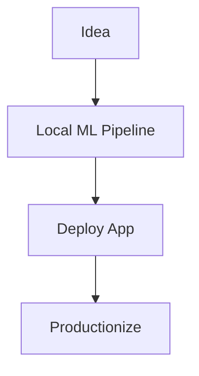
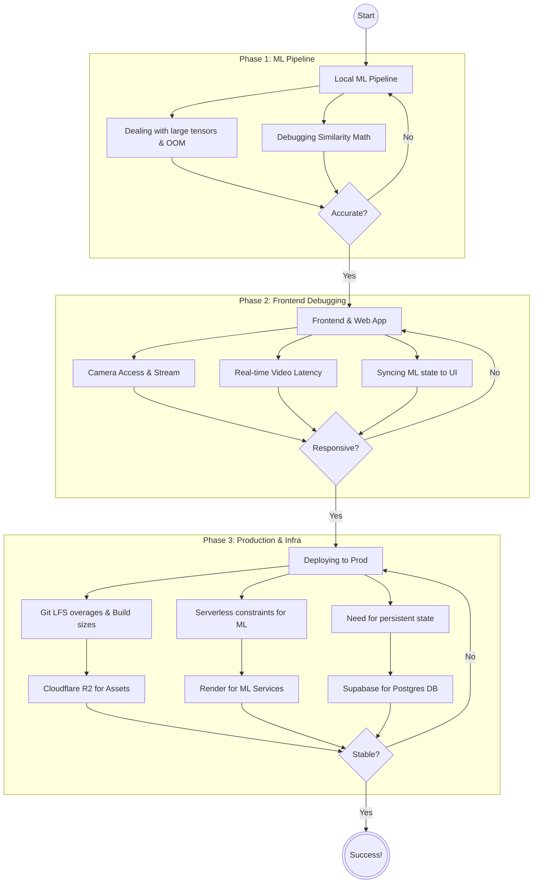

import { Icon } from 'astro-icon/components';

The sense of being able to role model habits/skills has never been higher for me since being a dad, and more so since my toddler is picking up new skills at quite the alarming pace (_insert proud dad moment_). Communication is so vital and little toddlers can pick up signs a lot faster than verbal language. My son started signs 'more' quite fervently during dinner time so we know he's atleast getting the 'food' part of our conversations. (_insert *another* proud dad moment_)

There's also another personal angle, my wife is fluent in ASL and as a multi-lingual household, we want to champion the languages (English, Hindi, ASL) for our son as he grows up as well. This is where the genesis of my problem starts. 

> How can I build an ASL learning mechanism that's sticky enough for me to keep up with the learning curve without it feeling like a chore?

A solution to this problem should:

* Give clear feedback
* Actually tell me how the sign works
* Be intuitive to use
* Ideally free (_after some spirited fight, I relented on this_)

In my head, I thought if I can build a simple app that can help me practice a sign and tell me how well am I signing it. Not just score me, but give some other kind of feedback as well in terms of how I'm moving my hands when I'm signing (ASL is heavily dependent on body language for grammar, but that's a more complex and nuanced problem to solve).

Enter [ASL Educator](https://bettersign.fyi) - My personal learning assistant to help me navigate the nuances of ASL.

#### Evolution of ASL Educator

The idea was simple. I turn on my webcam, sign a word and get immediate feedback. 

I was thinking with the power of <Icon name="tabler:sparkles-2"/>, I could knock this out in a weekend... oh how wrong was I. Nailing down the production deployment was a pro level game of whac-a-mole! A lot of it was self-inflicted as I was earlier trying to do this all of $0 using Render's free tier. 

> How I thought the dev process would largely be?

> How the dev process actually went?

I ended up spending _more time than I would have liked_ on ensuring that the ML service and the backend gateway can wake up in time as a user goes onto the app and tries to practice. The cold start for the app kept winning this battle. 

The things that didn't work for combating the free tier deployment:
* Adding a Github Action to send a ping to Render for the two services I had
* Increasing timeout for ML Service loadup
* Showing a waiting UI interstitial while the services woke up in the background
* Lazy Loading ML Data from Cloudflare R2
* Slimming down docker image

#### Parting Thoughts

Ultimately, I had to bite the bullet and upgrade from the free tier to keep the ML inference snappy. The small monthly cost is absolutely worth it to avoid losing my momentum while staring at a loading spinner. 

So, did I solve my original problem? Yes and no. The app is a solid start for nailing down the accuracy of individual signs, and I'm definitely keeping pace with my toddler's growing vocabulary (we're moving way past just "more" and "food" now!). 

But the journey doesn't stop here. To make this truly persistent long-term and habit forming, the next phase is moving from single-word recognition to full sentence-level processing. Oh, and adding some gamification—because nothing motivates quite like a 30-day streak! (gotta come up with an ASL-themed Duolingo pun). I should be getting some feedback from my relatives who happen to be in deaf education as well, so the MAU trend can climb a little bit as well (I'm all about those metrics).

Until then, I've got some signs to practice.

All code and tech stack breakdown on [<Icon name="mdi:github" />](https://github.com/uramawat/ASLEducator)